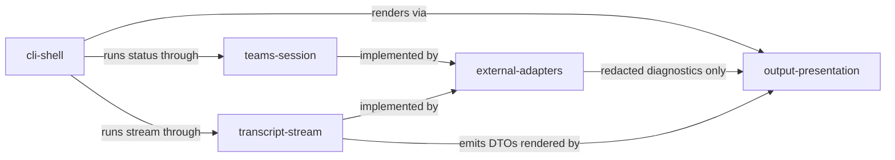

# Domain Map

## Dependency Rules

| From | To | Rule |
|------|----|------|
| cli-shell | output-presentation | CLI may use public renderers only. |
| cli-shell | teams-session | CLI may use public session port/types only. |
| cli-shell | transcript-stream | CLI may use public transcript port/types only. |
| teams-session | external-adapters | Domain defines ports; adapters implement them. |
| transcript-stream | external-adapters | Domain defines ports/events; adapters implement sources. |
| external-adapters | output-presentation | Adapters may return redacted diagnostics; they must not render output directly. |

## Health Summary

| Edge | Health | Notes |
|------|--------|-------|
| cli-shell -> output-presentation | implemented | CLI uses output contracts through command results/renderers. |
| cli-shell -> teams-session | implemented | Status command uses Teams session port and adapter. |
| cli-shell -> transcript-stream | implemented | Stream command uses transcript source port and adapter. |
| teams-session/transcript-stream -> external-adapters | implemented | Edge CDP, Teams tab, transcript probe, redaction, and diagnostics adapters exist. |
