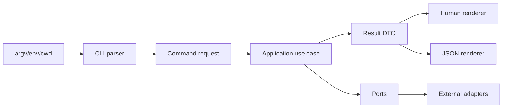

# Research Report: Start a Little CLI

**Generated**: 2026-05-29T11:06:00+10:00  
**Research Query**: "start a little CLI in this folder. clean code with adapters that connect to external things, and composition later. CLI to have standard output wrappers, --json mode and default to human mode. use to set us up"  
**Mode**: Pre-Plan  
**Location**: `docs/plans/001-start-little-cli/research-dossier.md`  
**FlowSpace**: Not Available  
**Findings**: 68

## Executive Summary

### What It Does

This folder is empty and has no current CLI, package metadata, source tree, tests, documentation, domain registry, or harness. The requested work is a greenfield CLI scaffold with clean boundaries: CLI parsing at the edge, core use cases in pure modules, external systems behind adapters, and output wrappers that support human output by default plus `--json`.

### Business Purpose

The CLI should provide a small local tool foundation for future Teams/transcript exploration work while keeping external browser, network, filesystem, and token/session concerns isolated behind adapters.

### Key Insights

1. The first implementation should establish boundaries, not features: `cli -> app/use-cases -> ports -> adapters -> output`.
2. `--json` should be a presentation switch only; core command logic should return structured results that both renderers consume.
3. A single composition root should wire adapters and use cases, so later composition does not leak setup code into commands.

### Quick Stats

- **Components**: 0 existing files; recommended initial scaffold is 8-12 files.
- **Dependencies**: 0 current internal or external dependencies.
- **Test Coverage**: None.
- **Complexity**: Low now; risk increases if output, adapters, and command parsing are mixed.
- **Prior Learnings**: 0 relevant discoveries; no `docs/plans` history existed before this dossier.
- **Domains**: No domain system.

## How It Currently Works

### Entry Points

| Entry Point | Type | Location | Purpose |
|------------|------|----------|---------|
| None | N/A | Repository root | No executable, package metadata, or command parser exists. |

### Core Execution Flow

No execution flow exists. The recommended initial flow is:

1. **Parse CLI args**
   - Future file: `src/cli/args.ts`
   - What happens: Convert `argv` into an immutable command request with flags such as `json`.

2. **Run application command**
   - Future file: `src/app/commands/*`
   - What happens: Execute pure use-case logic against injected ports/adapters.

3. **Render result**
   - Future file: `src/cli/output.ts`
   - What happens: Render the same result as human text or JSON.

4. **Map exit code**
   - Future file: `src/cli/main.ts`
   - What happens: Keep stdout/stderr and exit-code behavior stable for automation.

### Data Flow

### State Management

There is no state today. Initial implementation should keep state explicit in command context: `argv`, `cwd`, `env`, output mode, and injected adapters. Avoid global mutable state.

## Architecture & Design

### Component Map

Recommended initial components:

- **CLI entrypoint**: `src/cli/main.ts`
  - Responsibility: process lifecycle, parse args, call composition root, write output, exit.
- **Argument parser**: `src/cli/args.ts`
  - Responsibility: interpret flags and commands, including `--json`.
- **Output wrapper**: `src/cli/output.ts`
  - Responsibility: stdout/stderr discipline and human/JSON rendering.
- **Application command**: `src/app/*`
  - Responsibility: use-case orchestration and result construction.
- **Ports**: `src/ports/*`
  - Responsibility: interfaces for filesystem, network/browser/session, clock, env, process runner.
- **Adapters**: `src/adapters/*`
  - Responsibility: concrete implementations for external systems.
- **Composition root**: `src/bootstrap.ts`
  - Responsibility: wire ports, adapters, command handlers, and output.

### Design Patterns Identified

1. **Ports and Adapters**
   - Core depends on interfaces; concrete browser/network/filesystem behavior lives in adapters.
2. **Thin CLI Entrypoint**
   - The executable should parse, delegate, render, and exit only.
3. **Result Envelope**
   - Command handlers return `{ ok, data, error, meta }` rather than printing directly.
4. **Presenter/Renderer Split**
   - Human and JSON output consume the same DTO.
5. **Composition Root**
   - One module wires concrete dependencies for later composition.

### System Boundaries

- **Internal Boundaries**: CLI parsing, application use cases, output rendering, adapters, ports.
- **External Interfaces**: filesystem, network/CDP/browser, process environment, stdout/stderr.
- **Integration Points**: future Teams browser/CDP adapter and future transcript/source adapters.

## Dependencies & Integration

### What This Depends On

No dependencies exist today.

#### Recommended Internal Dependencies

| Dependency | Type | Purpose | Risk if Changed |
|------------|------|---------|-----------------|
| `src/cli/*` | Required | User-facing command contract | Breaking flags/output affects automation |
| `src/app/*` | Required | Core use-case logic | Breaking result shape affects renderers |
| `src/ports/*` | Required | Adapter contracts | Breaking interfaces affects all adapters |
| `src/adapters/*` | Optional per feature | External integration | External systems can fail or drift |
| `src/bootstrap.ts` | Required | Composition root | Bad wiring causes runtime failures |

#### External Dependencies

| Service/Library | Version | Purpose | Criticality |
|-----------------|---------|---------|-------------|
| Node.js runtime | TBD | CLI runtime | High |
| Argument parser | TBD or none | Parse flags/subcommands | Medium |
| Test runner | TBD | CLI and contract tests | Medium |
| Playwright/CDP | Future | Browser/Teams integration adapter | Medium/High |

### What Depends on This

Nothing depends on this CLI yet.

### Integration Architecture

Keep browser/CDP and network calls behind adapters. The CLI should not import Playwright or HTTP clients from command handlers; command handlers consume a narrow `TranscriptSource` or `TeamsSession` port when those capabilities are added.

## Quality & Testing

### Current Test Coverage

- **Unit Tests**: None.
- **Integration Tests**: None.
- **E2E Tests**: None.
- **Gaps**: Everything.

### Test Strategy Analysis

Establish these tests with the scaffold:

1. CLI parsing tests for default human mode and `--json`.
2. Renderer tests for stdout JSON envelope and human summaries.
3. Error mapping tests for exit code, stderr, and JSON error shape.
4. Use-case tests with fake adapters.
5. One smoke test that invokes the built CLI.

### Known Issues & Technical Debt

| Issue | Severity | Location | Impact |
|-------|----------|----------|--------|
| No package metadata | High | Root | Cannot run or install CLI |
| No source boundaries | High | Root | Easy to mix CLI, core, adapters, and output |
| No test harness | Medium | Root | Output contracts can drift |
| No docs | Medium | Root | CLI behavior not documented |

### Performance Characteristics

No runtime exists. Initial CLI should remain startup-light: defer Playwright/CDP imports until commands that need them.

## Modification Considerations

### Safe to Modify

1. **Greenfield file layout**: No existing consumers.
2. **Initial output schema**: Safe now; becomes costly after automation consumes it.
3. **Adapter contracts**: Safe now; should be kept narrow.

### Modify with Caution

1. **JSON envelope**
   - Risk: Future scripts may rely on it.
   - Mitigation: Version the schema in `meta.schemaVersion`.
2. **Exit-code mapping**
   - Risk: Automation depends on stable failures.
   - Mitigation: Centralize mapping in one CLI module.
3. **External adapters**
   - Risk: Browser/session/token concerns can leak.
   - Mitigation: Keep adapter outputs redacted and typed.

### Danger Zones

1. **Printing inside core use cases**
   - This breaks `--json` and composition.
2. **Importing external SDKs directly in commands**
   - This prevents fakes and makes startup heavy.
3. **Persisting browser/session tokens by default**
   - This creates avoidable security risk for Teams-related work.

### Extension Points

1. **New commands**
   - Add parser mapping plus a command handler returning a result DTO.
2. **New external systems**
   - Add a port and concrete adapter, wired in `bootstrap`.
3. **New output formats**
   - Add a renderer that consumes the existing result DTO.

## Prior Learnings

No prior learnings found directly related to this CLI.

Scanned repository context:

- `docs/plans`: did not exist before this dossier.
- `docs/domains`: not present.
- `docs/project-rules/harness.md`: not present.

Future discoveries should track:

| ID | Type | Key Insight | Action |
|----|------|-------------|--------|
| PL-01 | absence | No prior implementation exists | Start with contracts and tests |
| PL-02 | future-topic | Output mode and exit-code behavior | Record discoveries as commands are added |
| PL-03 | future-topic | Browser/CDP token/session handling | Document safety decisions before persistence |

## Domain Context

No domain registry found. Potential domains identified:

| Proposed Domain | Evidence | Boundary | Files |
|----------------|----------|----------|-------|
| CLI Shell | User request for command/output behavior | Args, commands, process lifecycle | future `src/cli/*` |
| Output Presentation | User request for wrappers, human default, `--json` | Human renderer, JSON renderer, stdout/stderr | future `src/cli/output.ts` |
| External Adapters | User request for adapters to external things | Filesystem, browser/CDP, network, env | future `src/adapters/*` |
| Application Core | User request for clean code and composition later | Pure use cases and DTOs | future `src/app/*` |

## Critical Discoveries

### Critical Finding 01: This is a greenfield scaffold

**Impact**: Critical  
**Source**: IA-01, IA-02, DE-01  
**What**: The folder has no executable, package metadata, source, tests, or docs.  
**Why It Matters**: The first change determines long-term boundaries.  
**Required Action**: Start with the smallest runnable CLI and preserve clean architecture seams.

### Critical Finding 02: Output mode must be centralized

**Impact**: High  
**Source**: PS-05, IC-02, QT-03  
**What**: Human and JSON output should be renderers over the same result DTO.  
**Why It Matters**: Mixing `console.log` into core logic will break automation and future composition.  
**Required Action**: Create an output wrapper before adding feature logic.

### Critical Finding 03: External access belongs behind adapters

**Impact**: High  
**Source**: DC-05, DB-03, IA-06  
**What**: Browser/CDP/network/filesystem/process access should be injected through ports.  
**Why It Matters**: Teams/transcript work touches sensitive external systems and needs fakes for testing.  
**Required Action**: Define narrow ports before concrete adapters.

## Supporting Documentation

### Related Documentation

None existed before this report.

### Recommended Minimal Documentation

- `README.md`: purpose, install/run, human and JSON examples.
- `docs/architecture.md`: boundaries and composition model.
- `docs/output-modes.md`: stdout/stderr, JSON envelope, exit-code contract.
- `docs/adrs/0001-cli-structure.md`: decision to use ports/adapters and centralized rendering.

## Recommendations

### If Implementing This System

1. Create a Node/TypeScript CLI scaffold with a `bin` entry and `src` layout.
2. Add a command that proves the output contract, such as `status`.
3. Implement `--json` as a global output flag that changes only rendering.
4. Define a typed result envelope and typed error shape.
5. Add tests for parsing, renderers, and exit behavior before adding external adapters.

### If Extending This System

1. Add each external integration as a port plus adapter.
2. Wire concrete adapters only in the composition root.
3. Keep long-lived browser/CDP/session work out of the CLI shell layer.

### If Refactoring This System

Not applicable yet. There is no implementation.

## External Research Opportunities

No external research gaps are required before scaffolding. Current decisions can be made from local requirements.

Potential later research:

1. Best official Graph/Teams transcript APIs versus live browser transport reverse engineering.
2. Safe handling of browser-derived session/token material in local developer tooling.

## Appendix: File Inventory

### Core Files

No core files exist yet.

### Test Files

No test files exist yet.

### Configuration Files

No configuration files exist yet.

## Next Steps

Run `/plan-1b-specify "start a little CLI in this folder with clean adapters, a composition root, standard output wrappers, --json mode, and default human output"` to create the feature specification.

---

**Research Complete**: 2026-05-29T11:06:00+10:00  
**Report Location**: `docs/plans/001-start-little-cli/research-dossier.md`
